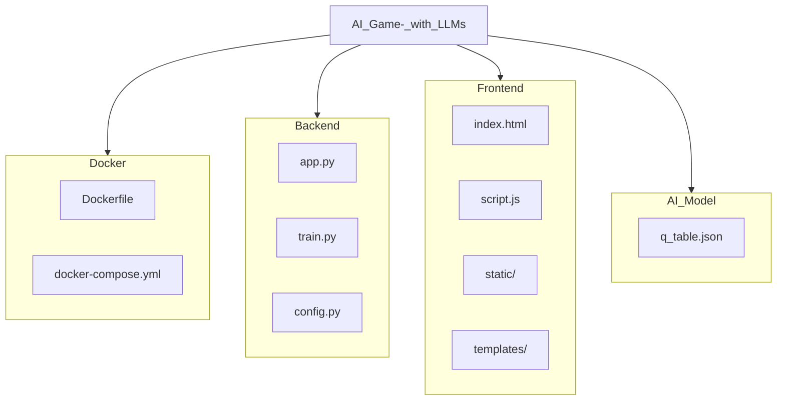

```mermaid
graph TD

    A[AI_Game-_with_LLMs]

    subgraph Docker
        B1[Dockerfile]
        B2[docker-compose.yml]
    end

    subgraph Backend
        C1[app.py]
        C2[train.py]
        C3[config.py]
    end

    subgraph Frontend
        D1[index.html]
        D2[script.js]
        D3[static/]
        D4[templates/]
    end

    subgraph AI_Model
        E1[q_table.json]
    end

    A --> Docker
    A --> Backend
    A --> Frontend
    A --> AI_Model
```
